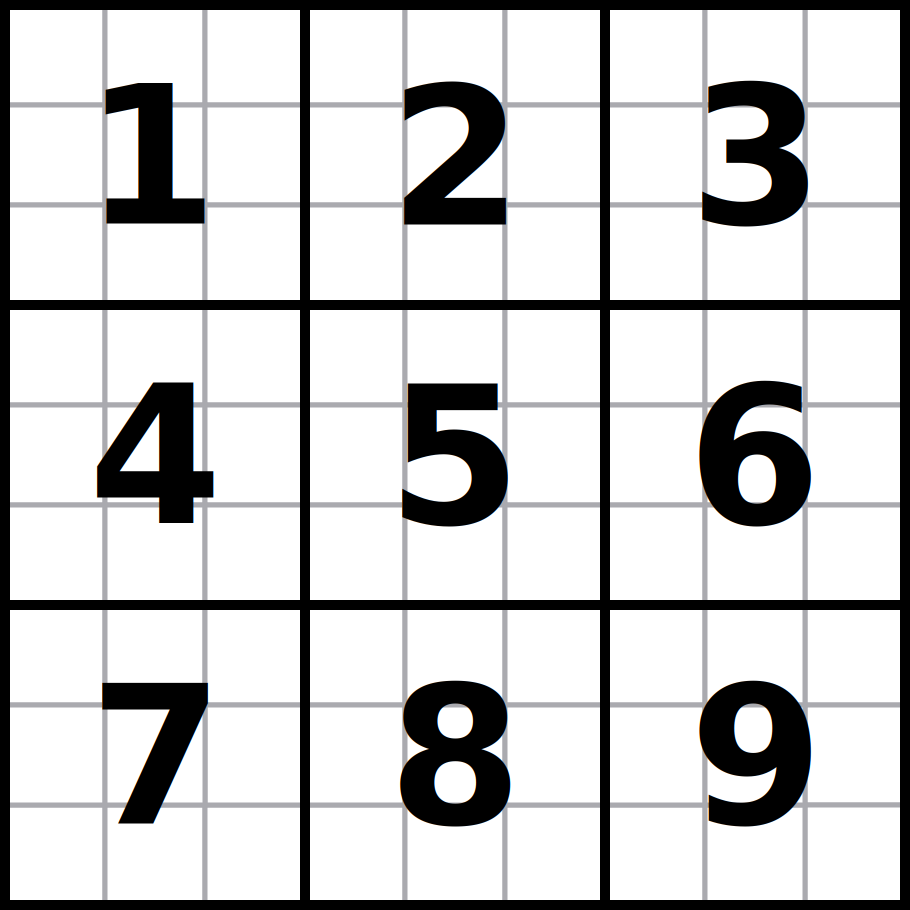
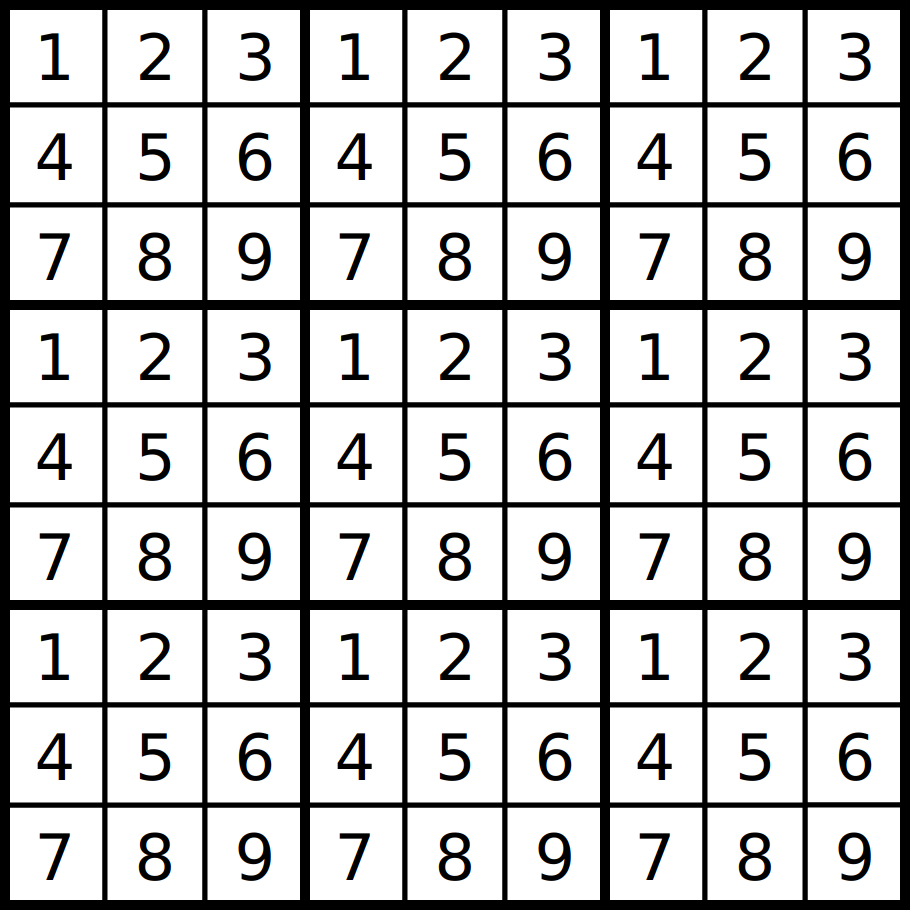

Introduction
------------

Task is to implement an AI player for the game
"Ultimate Tic-Tac-Toe" in Haskell.


Game Rules
----------

Ultimate tic-tac-toe is a board game for two players. We will call the players
X and O.

The game is played on nine individual tic-tac-toe boards arranged in a 3-by-3
grid. Each field of a small board is either empty, marked X, or marked O.

We will number the small boards from 1 to 9, from top left to bottom right:



Moreover, on each small board, we will number the fields from 1 to 9, again
from top left to bottom right:



Initially, all 81 fields are empty. Players take alternate turns. X moves first.

A move consists of choosing a small board b (1 ≤ b ≤ 9) and an empty field f
(1 ≤ f ≤ 9) on that board. The field is marked with the name of the current
player. Once three fields in a (horizontal, vertical or diagonal) row on a small
board have been marked with the same name, the board is marked as won by that
player (just like in regular tic-tac-toe).

On all moves but the first, the current player must play on the small board
indicated by the relative location of the field that the opponent chose for
their previous move. For instance, if player X chose to mark field 3 (on some
small board), on the following move player O must play (on some empty field) on
board 3.

As an exception from this rule, if a player would have to play on a small board
that is marked as won or that does not have any empty fields, that player must
choose any other board (that is not marked as won and that has an empty field)
instead.

The game ends when either player has won three small boards in a (horizontal,
vertical or diagonal) row. This player wins the game of ultimate tic-tac-toe.
Altenatively, the game ends when there are no legal moves remaining (i.e., all
small boards have been filled or marked as won); in this case, the game is a
draw.

See <https://en.wikipedia.org/wiki/Ultimate_tic-tac-toe> for diagrams and
further explanations.

Task
---------

Task is to write a single file called `UltimateTicTacToeAI.hs` that
declares a module `UltimateTicTacToeAI`.

Module `UltimateTicTacToeAI` must import the `UltimateTicTacToe` module.
This exports types `Player` and `Move` (with their constructors) that have been
defined as follows:

```haskell
{- The two players: X and O.
 -}
data Player = X | O

{- Game moves.
   Move b f represents a move on board b, field f.
   INVARIANT: 1 ≤ b ≤ 9 and 1 ≤ f ≤ 9.
 -}
data Move = Move Int Int
```


Module `UltimateTicTacToeAI` must export the following types, values, and
functions:

```haskell
type State  -- the internal state of your AI
author :: String
nickname :: String
initial :: UltimateTicTacToe.Player -> State
think :: State -> Maybe UltimateTicTacToe.Move -> Double -> (UltimateTicTacToe.Move, State)
```

These are specified as follows:

- `State` encodes the internal state of your AI, i.e., any information that your
  AI wants to keep track of between different invocations of `think`. (This
  information will likely include a representation of the board and current
  player.) Your module may define `State` any way you see fit.

- `author` is your (first and last) name.

- `nickname` is an arbitrary string (of at most 20 ASCII characters) chosen by
  you to identify your AI. It will be used to report the
  [evaluation](#evaluation) results pseudonymously.

- `initial` takes an argument that indicates whether your AI will be playing X
  or O, and returns the initial state of your AI.

- `think` takes three arguments: the current state of your AI, your opponent's
  last move, and the time remaining for your AI (in seconds) to play the rest of
  the game.

  The `move` argument will be `Nothing` when your AI is playing X and making the
  first move of the game.

  `think` returns a pair `(m,s)`, where `m` is the move that your AI wants to
  take, and `s` is your AI's internal state after taking this move. (`s` will be
  passed to the *next* invocation of your AI's think function, along with your
  opponent's response to `m`.)


